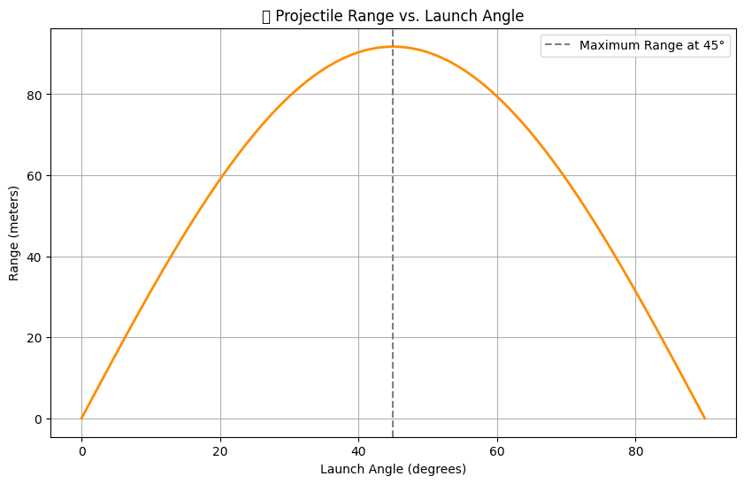

# ⚙️ Mechanics – Problem 1

## 🎯 Investigating the Range as a Function of the Angle of Projection

---

## 🧠 Motivation

Projectile motion is one of the most fundamental yet insightful topics in classical mechanics. While it may seem simple at first, it offers a rich framework to explore the relationships between velocity, angle, gravity, and trajectory.

This task focuses on understanding how the **range** of a projectile depends on the **angle of projection**, while considering the influence of other variables such as initial velocity and gravitational acceleration.

---

## 📐 1. Theoretical Foundation

### Equations of Motion

A projectile launched at an angle \( \theta \) with an initial velocity \( v_0 \) follows a curved path (parabola) due to the influence of gravity. The motion can be separated into two components:

- Horizontal motion (constant velocity)
- Vertical motion (uniform acceleration due to gravity)

### Velocity Components

The initial velocity is split into horizontal and vertical components:

$$
v_{0x} = v_0 \cos(\theta), \quad v_{0y} = v_0 \sin(\theta)
$$

### Time of Flight

Assuming the projectile lands at the same vertical level it was launched:

$$
T = \frac{2 v_0 \sin(\theta)}{g}
$$

### Range Formula

The horizontal distance (range) the projectile travels before hitting the ground is:

$$
R = v_{0x} \cdot T = v_0 \cos(\theta) \cdot \frac{2 v_0 \sin(\theta)}{g} = \frac{v_0^2 \sin(2\theta)}{g}
$$

**Maximum range** is achieved when:

$$
\theta = 45^\circ
$$

This formula is valid only when the launch and landing heights are the same and air resistance is neglected.

---

## 📊 2. Range Analysis with Python

Now let's analyze how the range varies with the angle of projection using Python and visualize it with a graph.

```python
import numpy as np
import matplotlib.pyplot as plt

# Constants
v0 = 30  # initial velocity in m/s
g = 9.81  # acceleration due to gravity in m/s^2

# Angle values from 0 to 90 degrees
angles = np.linspace(0, 90, 500)
angles_rad = np.radians(angles)

# Range formula
ranges = (v0 ** 2) * np.sin(2 * angles_rad) / g

# Plotting
plt.figure(figsize=(10, 6))
plt.plot(angles, ranges, color='darkorange', linewidth=2)
plt.title('Projectile Range vs. Launch Angle')
plt.xlabel('Launch Angle (degrees)')
plt.ylabel('Range (meters)')
plt.axvline(45, linestyle='--', color='gray', label='Maximum Range at 45°')
plt.grid(True)
plt.legend()
plt.show()


