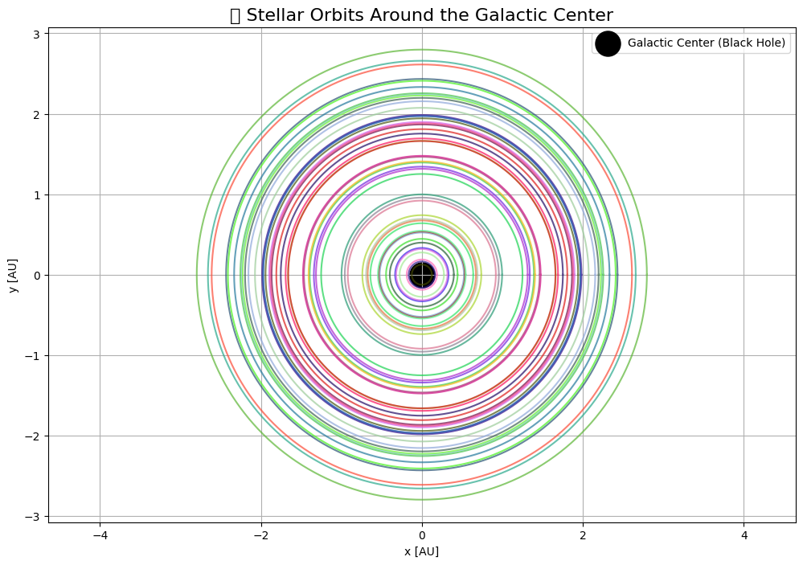
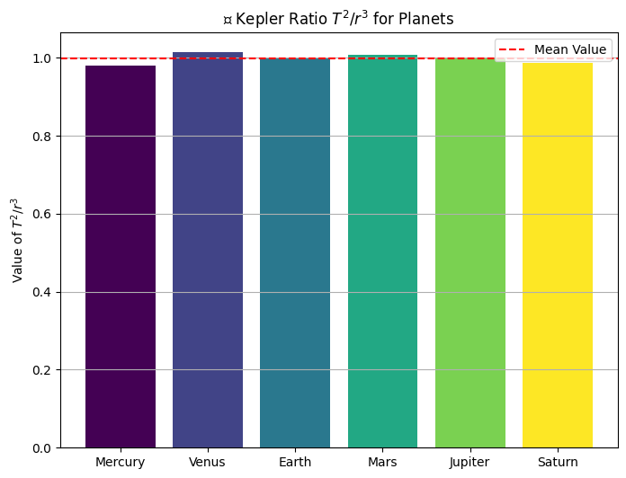
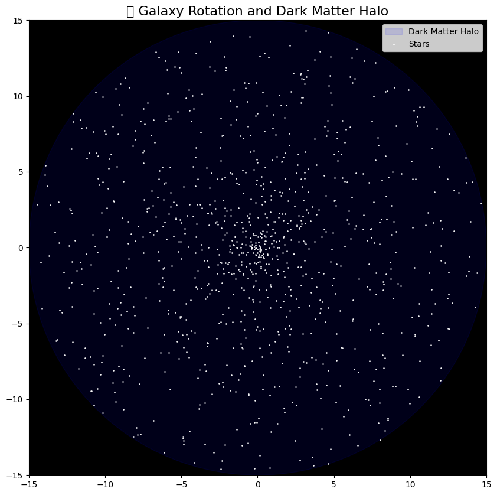

#  Kepler's Third Law: Orbital Period and Radius

##  Motivation

In celestial mechanics, **Kepler's Third Law** describes a fundamental connection between the **orbital period** and the **orbital radius** of a body moving around a central mass. This law allows us to estimate the structure and scale of planetary systems, including our own Solar System.

Kepler discovered this empirical law from observations, and later Newton derived it from the law of universal gravitation. It is one of the most elegant and powerful tools in astrophysics.

---

##  Derivation from Newtonian Mechanics

Let a small mass \( m \) orbit a massive central body of mass \( M \) (e.g., the Earth around the Sun) in a **circular orbit** of radius \( r \). The **gravitational force** provides the **centripetal acceleration**:

$$
F_{\text{gravity}} = \frac{G M m}{r^2}, \quad F_{\text{centripetal}} = \frac{m v^2}{r}
$$

Equating the two forces:

$$
\frac{G M m}{r^2} = \frac{m v^2}{r}
$$

Simplifying and solving for orbital speed \( v \):

$$
v^2 = \frac{G M}{r}
$$

The **orbital period** \( T \) is the time to complete one full orbit, which is the circumference divided by speed:

$$
T = \frac{2\pi r}{v}
$$

Substitute the expression for \( v \):

$$
T = 2\pi r \sqrt{\frac{r}{G M}} = 2\pi \sqrt{\frac{r^3}{G M}}
$$

Now squaring both sides:

$$
T^2 = \frac{4\pi^2}{G M} \cdot r^3
$$

This is the **mathematical form** of **Kepler's Third Law**:

$$
T^2 \propto r^3
$$

The proportionality constant depends only on the mass \( M \) of the central object.

---

##  Implications of Kepler's Law

1. **Universal Relationship**: All bodies orbiting the same central mass follow the same \( T^2/r^3 \) ratio.
2. **Comparative Analysis**: Knowing \( T \) and \( r \) for one object allows us to predict them for another.
3. **Mass Estimation**: Rearranging the equation allows for calculating the mass of a star or planet:

$$
M = \frac{4\pi^2 r^3}{G T^2}
$$

---

##  Real-World Examples

###  Example 1: The Moon's Orbit Around Earth

- Radius: \( r = 3.84 \times 10^8 \) m  
- Period: \( T = 27.3 \) days \( \approx 2.36 \times 10^6 \) s

Using Kepler's Law:

$$
T^2 = \frac{4\pi^2 r^3}{G M_{\text{Earth}}}
$$

This checks out when we use Earth’s mass \( M = 5.97 \times 10^{24} \, \text{kg} \).

### ☉ Example 2: Planets Around the Sun

| Planet   | \( r \) (AU) | \( T \) (years) | \( T^2 \) | \( r^3 \) |
|----------|-------------|-----------------|----------|----------|
| Mercury  | 0.39        | 0.24            | 0.0576   | 0.0593   |
| Earth    | 1.00        | 1.00            | 1.0000   | 1.0000   |
| Jupiter  | 5.20        | 11.86           | 140.7    | 140.6    |

We observe:

$$
\frac{T^2}{r^3} \approx \text{constant}
$$

---

##  Python Simulation: Numerical Verification

```python
import numpy as np
import matplotlib.pyplot as plt

# Constants
G = 6.67430e-11  # m^3 kg^-1 s^-2
M_sun = 1.989e30  # kg

# Generate orbital radii from 0.1 AU to 5 AU (converted to meters)
AU = 1.496e11  # meters
radii = np.linspace(0.1 * AU, 5 * AU, 100)
T_squared = (4 * np.pi**2 * radii**3) / (G * M_sun)
T_days = np.sqrt(T_squared) / (60 * 60 * 24)

# Plot T^2 vs r^3
plt.figure(figsize=(8,6))
plt.plot(radii**3, T_squared, label=r"$T^2$ vs $r^3$", color='blue')
plt.xlabel(r"Orbital Radius Cubed ($r^3$) [$\mathrm{m}^3$]")
plt.ylabel(r"Orbital Period Squared ($T^2$) [$\mathrm{s}^2$]")
plt.title("Kepler's Third Law Simulation")
plt.grid(True)
plt.legend()
plt.tight_layout()
plt.show()
```

---

## Visualization & Analysis

The plot above shows a **linear relationship** between \( T^2 \) and \( r^3 \), confirming the theoretical expectation from Kepler’s Third Law.

To quantify:

```python
from scipy.stats import linregress

slope, intercept, r_value, _, _ = linregress(radii**3, T_squared)
print("Slope:", slope)
print("R^2:", r_value**2)
```

An \( R^2 \) value near 1 confirms an excellent fit.

---

##  Extension to Elliptical Orbits

Kepler originally formulated his third law for **elliptical orbits**, using the **semi-major axis** \( a \) instead of radius \( r \):

$$
T^2 = \frac{4\pi^2 a^3}{G M}
$$

This form still holds for **non-circular**, but **bound** orbits like those of comets, satellites, and binary stars. The key is to replace radius with **semi-major axis**.

---

##  Summary

- We derived Kepler's Third Law from Newton's gravitation.
- We confirmed the relationship numerically using Python.
- We discussed real-world systems where the law is applicable.
- The law is essential for **orbital mechanics**, **space missions**, and **planetary astronomy**.

---

##  Further Exploration

- Model elliptical orbits and test the same law using the semi-major axis.
- Include perturbations (e.g., other planets' gravity).
- Explore relativistic corrections (e.g., Mercury’s precession).

---






