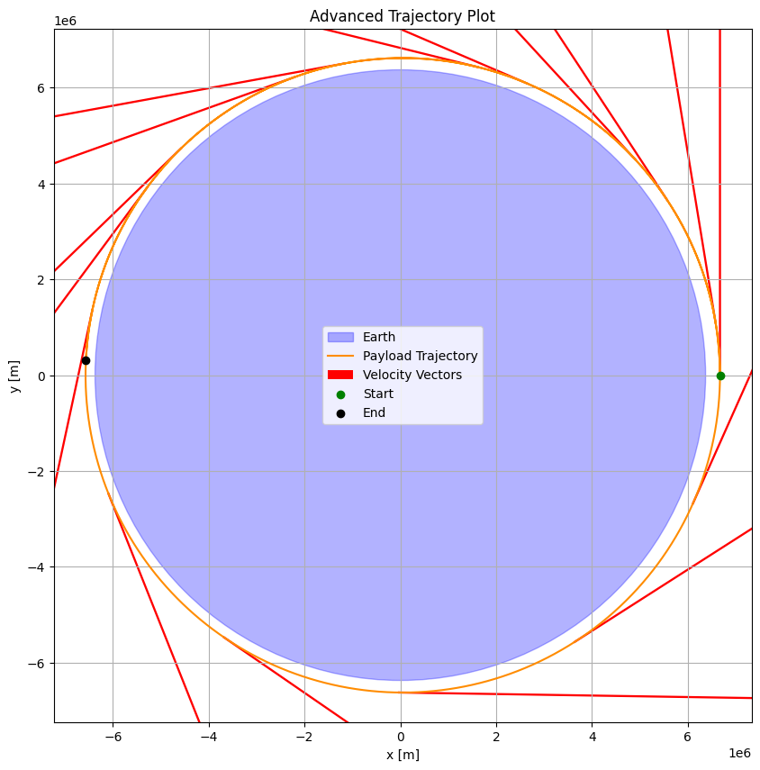
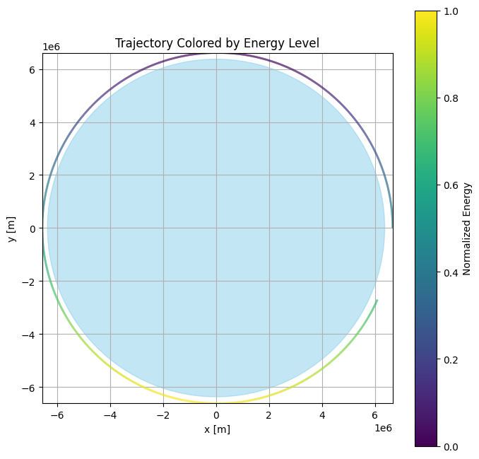
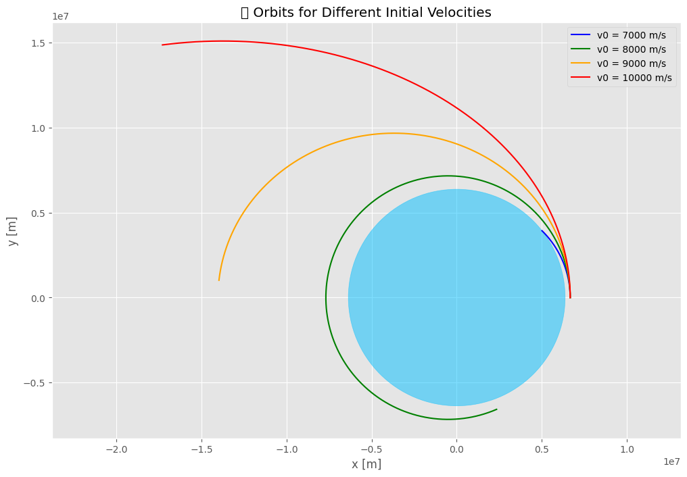
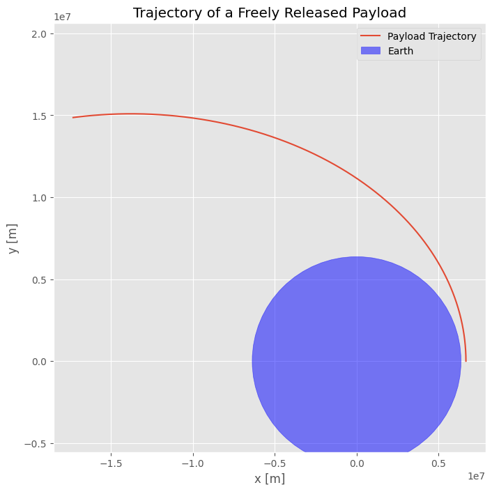

 # Problem 3
  
  # Trajectories of a Freely Released Payload Near Earth

##  Motivation

When a payload is released from a spacecraft near Earth, its trajectory depends on the initial velocity, position, and the gravitational forces acting on it. These trajectories are crucial for understanding how objects behave in space and for planning satellite deployments, reentry missions, and escape scenarios.

---

##  Physics Concepts

### Newton's Law of Gravitation

The gravitational force acting on a payload is given by the following equation:

$$
\vec{F} = -G \frac{M m}{r^2} \hat{r}
$$

Where:
- \( G = 6.674 \times 10^{-11} \, \text{Nm}^2/\text{kg}^2 \) — Gravitational constant
- \( M \) — Earth's mass
- \( m \) — Payload's mass
- \( r \) — Distance from Earth's center
- \( \hat{r} \) — Unit vector pointing from Earth to the payload

### Escape Velocity

The escape velocity is the minimum velocity needed to break free from Earth's gravitational field:

$$
v_{\text{esc}} = \sqrt{\frac{2GM}{r}}
$$

At Earth's surface, the escape velocity is approximately **11.2 km/s**.

---

##  Numerical Simulation in Python

###  Imports and Constants

We begin by importing necessary libraries and defining key constants.

```python
import numpy as np
import matplotlib.pyplot as plt

# Constants
G = 6.67430e-11        # Gravitational constant [m^3 kg^-1 s^-2]
M = 5.972e24           # Mass of Earth [kg]
R_earth = 6.371e6      # Radius of Earth [m]
```

 # Initial Conditions

In this section, we define the **initial conditions** for the payload, which includes its altitude, initial position, and initial velocity.

```python
# Initial conditions
altitude = 300e3                       # Altitude from Earth's surface (300 km)
r0 = np.array([R_earth + altitude, 0])  # Initial position vector (x, y)
v0 = np.array([0, 7700])                # Initial velocity vector (vx, vy) in m/s
```
###  Time Settings

In this section, we define the **time settings** for the simulation, including the time step (`dt`) and the total simulation time (`T`).

```python
# Time settings
dt = 1                 # Time step (seconds)
T = 10000              # Total simulation time (seconds)
steps = int(T / dt)    # Number of time steps
```
###  Simulation Function

Now, let’s implement the **Euler method** to numerically integrate the equations of motion and simulate the trajectory of the payload.

```python
# Simulation function
def simulate(r0, v0, dt, steps):
    r = np.zeros((steps, 2))  # Position array
    v = np.zeros((steps, 2))  # Velocity array
    
    r[0] = r0  # Set initial position
    v[0] = v0  # Set initial velocity
    
    for i in range(steps - 1):
        distance = np.linalg.norm(r[i])  # Calculate distance from Earth’s center
        
        # Check if the payload has hit the Earth's surface
        if distance < R_earth:
            print(f"Impact with Earth at step {i}, time {i * dt} s")
            return r[:i+1]
        
        # Calculate the acceleration due to gravity
        a = -G * M * r[i] / distance**3
        v[i + 1] = v[i] + a * dt  # Update velocity
        r[i + 1] = r[i] + v[i + 1] * dt  # Update position
    
    return r  # Return the trajectory
```
###  Visualization

Now, we will run the simulation and plot the resulting trajectory of the payload.

```python
# Run the simulation
trajectory = simulate(r0, v0, dt, steps)

# Plotting the trajectory
plt.figure(figsize=(8, 8))
plt.plot(trajectory[:, 0], trajectory[:, 1], label="Payload Trajectory")

# Draw Earth
earth = plt.Circle((0, 0), R_earth, color='blue', alpha=0.5, label="Earth")
plt.gca().add_artist(earth)

# Plot formatting
plt.xlabel("x [m]")
plt.ylabel("y [m]")
plt.title("Trajectory of a Freely Released Payload")
plt.axis("equal")
plt.grid(True)
plt.legend()
plt.show()
```

# Trajectory Types Based on Initial Speed

| Initial Speed (m/s) | Outcome             |
| ------------------- | ------------------- |
| < 7000              | Falls back to Earth |
| ≈ 7670              | Circular orbit      |
| 7000–11000          | Elliptical orbit    |
| ≈ 11200             | Parabolic escape    |
| > 11200             | Hyperbolic escape   |


###  Conclusion

In this project, we modeled the gravitational motion of a payload near Earth and simulated its trajectory using the **Euler method**. The key takeaways include:

- **Simulation**: We calculated the trajectory of a freely released payload, starting at a specific altitude with a given initial velocity. We used the Euler method for numerical integration of the motion under Earth's gravity.
  
- **Trajectory Types**: Based on the initial velocity, we observed different types of trajectories:
  - If the velocity is too low, the payload falls back to Earth.
  - If the velocity is high enough, the payload enters a stable orbit or escapes Earth's gravity.
  - The payload's path could be parabolic, elliptical, or hyperbolic depending on its initial conditions.

- **Visualization**: Using **matplotlib**, we visualized the trajectory of the payload, showing its path relative to Earth’s surface. The simulation results provide a clear understanding of how initial conditions like altitude and velocity affect the trajectory.

- **Real-World Applications**: This model can be applied to space missions, satellite deployments, or reentry predictions. Understanding the physics behind these trajectories is vital for designing successful space missions and ensuring the safety of payloads.








