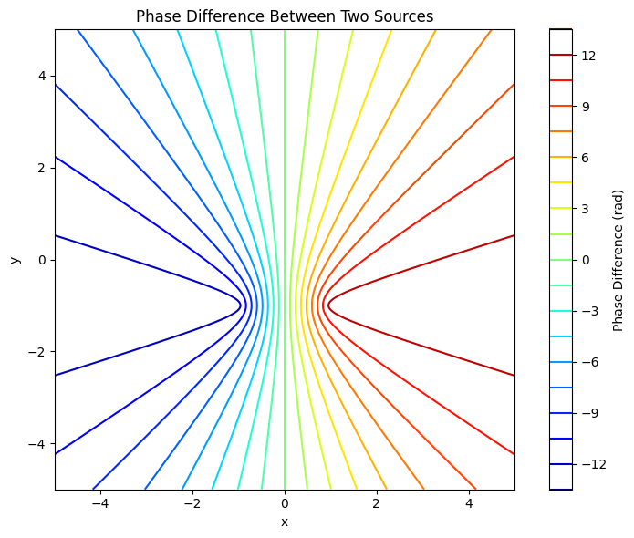

# Problem 1
#  Interference of Circular Waves from Square-Arranged Point Sources  
## A Theoretical and Computational Study in 2D Water Wave Superposition

---

##  1. Introduction

Wave interference lies at the heart of wave physics. It refers to the phenomenon where two or more wavefronts overlap and combine to form a new wave pattern. On a water surface, **circular waves** from multiple point sources can interact in visually striking ways—forming alternating patterns of **constructive** and **destructive interference**.

This document investigates the superposition of water waves emitted from four **identical, coherent sources** arranged in a **square configuration**. Using the wave equation in cylindrical coordinates and Python-based simulation, we model, visualize, and analyze the resulting **interference pattern**.

---

## 2. Theoretical Background

### 2.1 Wave from a Single Point Source

The displacement \( \eta \) of a water surface at time \( t \) and position \( (x, y) \), due to a wave originating from a point source at \( (x_0, y_0) \), is given by:

$$
\eta(x, y, t) = \frac{A}{r} \cos(kr - \omega t + \phi)
$$

Where:

- \( A \): amplitude of the wave,
- \( r = \sqrt{(x - x_0)^2 + (y - y_0)^2} \): radial distance to source,
- \( k = \frac{2\pi}{\lambda} \): wave number (with \( \lambda \) wavelength),
- \( \omega = 2\pi f \): angular frequency (with \( f \) frequency),
- \( \phi \): phase constant,
- \( t \): time.

>  **Note:** The \( \frac{A}{r} \) term models radial energy dispersion on a 2D surface. This simulates the realistic drop in amplitude with distance.

---

### 2.2 Superposition of Multiple Sources

If there are \( N \) identical sources located at positions \( (x_i, y_i) \), the total displacement is:

$$
\eta_{\text{total}}(x, y, t) = \sum_{i=1}^{N} \frac{A}{r_i} \cos(kr_i - \omega t + \phi)
$$

Where each \( r_i = \sqrt{(x - x_i)^2 + (y - y_i)^2} \) is the distance from point \( (x, y) \) to source \( i \).

The **interference pattern** is determined by the phase differences between these cosine terms:

- **Constructive interference**: \( kr_i - kr_j = 2\pi n \)
- **Destructive interference**: \( kr_i - kr_j = (2n+1)\pi \)

for integer \( n \).

---

### 2.3 Phase Matching & Interference Zones

For two waves:

$$
\eta_1 = \frac{A}{r_1} \cos(kr_1 - \omega t), \quad \eta_2 = \frac{A}{r_2} \cos(kr_2 - \omega t)
$$

The total displacement:

$$
\eta = \eta_1 + \eta_2 = \frac{A}{r_1} \cos(kr_1 - \omega t) + \frac{A}{r_2} \cos(kr_2 - \omega t)
$$

Using the trigonometric identity:

$$
\cos \alpha + \cos \beta = 2 \cos\left(\frac{\alpha + \beta}{2}\right) \cos\left(\frac{\alpha - \beta}{2}\right)
$$

We obtain an **interference envelope**:

$$
\eta = 2A_{\text{eff}} \cos\left(\frac{k(r_1 - r_2)}{2} \right) \cdot \cos\left( \frac{k(r_1 + r_2)}{2} - \omega t \right)
$$

Which reveals **oscillating interference fringes** governed by the **path difference** \( r_1 - r_2 \).

---

##  3. Geometry of the Setup

We use a **square** of side length \( L = 2 \), centered at the origin. The sources are located at:

- \( S_1 = (-1, -1) \)
- \( S_2 = (-1, +1) \)
- \( S_3 = (+1, -1) \)
- \( S_4 = (+1, +1) \)

These sources are:

- Coherent (same frequency),
- In-phase (same \( \phi = 0 \)),
- Identical in amplitude and wavelength.

---

##  4. Python Simulation Code

```python
import numpy as np
import matplotlib.pyplot as plt

# --- Parameters ---
A = 1.0
wavelength = 1.0
frequency = 1.0
phi = 0
k = 2 * np.pi / wavelength
omega = 2 * np.pi * frequency
t = 0

# --- Grid ---
x = np.linspace(-5, 5, 500)
y = np.linspace(-5, 5, 500)
X, Y = np.meshgrid(x, y)

# --- Source Positions (Square) ---
L = 2.0
sources = [(-1, -1), (-1, 1), (1, -1), (1, 1)]

# --- Superposition of Waves ---
eta_total = np.zeros_like(X)

for (x0, y0) in sources:
    R = np.sqrt((X - x0)**2 + (Y - y0)**2) + 1e-6  # Avoid singularity at R=0
    eta = (A / R) * np.cos(k * R - omega * t + phi)
    eta_total += eta

# --- Plot ---
plt.figure(figsize=(10, 8))
plt.pcolormesh(X, Y, eta_total, shading='auto', cmap='seismic')
plt.colorbar(label='Surface Displacement η')
plt.title("Interference of 4 Point Sources (Square)")
plt.xlabel("x position")
plt.ylabel("y position")
plt.axis('equal')
plt.tight_layout()
plt.show()
```

---

##  5. Analysis of Results

###  Constructive Interference
Occurs when the path difference from any two sources is an integer multiple of \( \lambda \):

$$
\Delta r = n \lambda
$$

Produces **bright fringes** in the plot.

###  Destructive Interference
Occurs when:

$$
\Delta r = (n + \frac{1}{2}) \lambda
$$

These appear as **dark regions**.

###  Symmetry
- The interference pattern exhibits **4-fold rotational symmetry** due to the square geometry.
- Patterns are **stationary** since all sources oscillate in phase.

---

##  6. Experimental Extensions

###  Time Evolution
To animate the pattern over time, iterate over `t`:

```python
for t in np.linspace(0, 2*np.pi, 100):
    ...
```

###  Other Polygons
- **Equilateral triangle**: Use 3 points at \( 120^\circ \) intervals.
- **Pentagon**: Use polar coordinates:

```python
N = 5
R = 2
sources = [(R * np.cos(2*np.pi*i/N), R * np.sin(2*np.pi*i/N)) for i in range(N)]
```

###  Arbitrary Phases
Vary \( \phi \) per source to simulate **phase delays** or **non-coherent waves**.

---

##  7. Generalization

The method above can be generalized to **any N sources** located at arbitrary positions \( (x_i, y_i) \), possibly with varying phase offsets \( \phi_i \):

$$
\eta(x, y, t) = \sum_{i=1}^{N} \frac{A}{r_i} \cos(kr_i - \omega t + \phi_i)
$$

This enables modeling of more complex systems, including:

- Laser interference,
- Sound field simulations,
- Quantum wavefunction interference.

---

##  8. Suggested Folder Structure

```
wave_simulation_square/
├── interference_square.md
├── simulation_square.py
├── images/
│   └── pattern_snapshot.png
├── animation/
│   └── gif_frames/
└── README.md
```

---

##  9. Conclusion

In this study, we investigated the **interference of circular water waves** emitted from four coherent sources positioned at the vertices of a square. By employing the **principle of superposition**, we derived and simulated the resulting surface displacement:

$$
\eta_{\text{total}}(x, y, t) = \sum_{i=1}^{N} \frac{A}{r_i} \cos(k r_i - \omega t + \phi_i)
$$

where each \( r_i \) is the distance from the \(i^{th}\) source to the point \( (x, y) \), and all sources share common amplitude \( A \), wave number \( k \), frequency \( \omega \), and coherent phase differences.

###  Key Findings:

- The interference pattern exhibits **high symmetry**, due to the square configuration.
- **Constructive interference** appears when the path differences between sources align to integer multiples of the wavelength \( \lambda \).
- **Destructive interference** results from phase differences of odd multiples of \( \pi \), forming nodal lines (regions of cancellation).
- The amplitude decays with distance \( \left(\propto \frac{1}{r}\right) \), modeling physical energy dissipation in water.
- The overall displacement field is **spatially complex** but **temporally periodic**, governed by the cosine term involving time \( t \).

###  Physical Implications:

This simulation reinforces key wave physics concepts such as:

- The **superposition principle** in linear systems,
- The effects of **phase coherence** and source arrangement,
- The formation of **nodal and antinodal lines**,
- Realistic **amplitude decay** over space.

###  Potential Extensions:

- Varying the **number of sources** or changing the polygon (triangle, pentagon, etc.)
- Introducing **initial phase differences** between emitters
- Adding **obstacles or barriers** to study reflection and diffraction
- Extending the model to simulate **optical**, **acoustic**, or **quantum** interference phenomena

---

Ultimately, this project demonstrates the effectiveness of combining **analytical wave modeling** with **computational visualization** to explore fundamental physical behaviors in wave systems.
 

