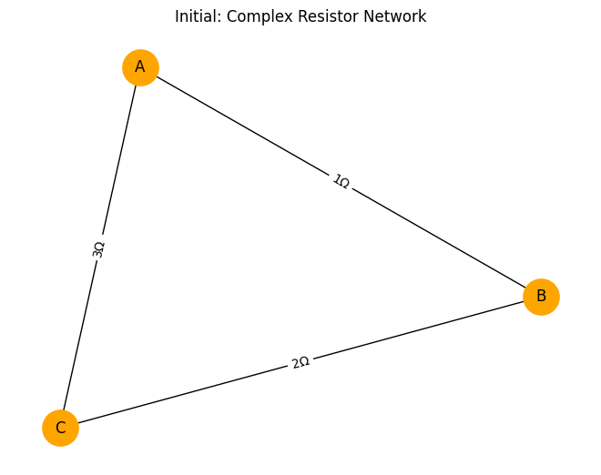
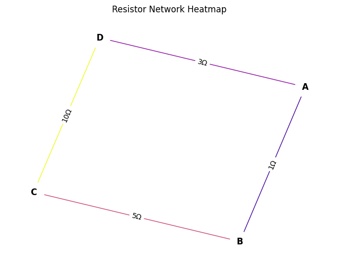
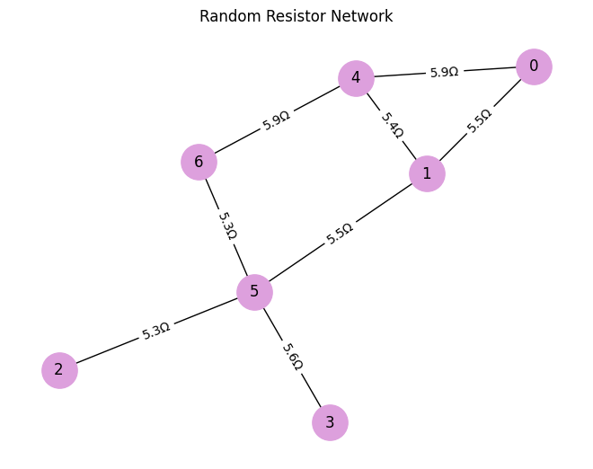
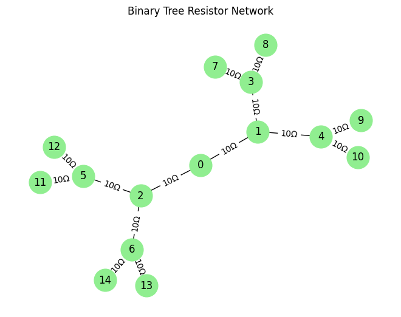

# Problem 1
#  Equivalent Resistance Using Graph Theory

---

##  Motivation

Calculating equivalent resistance is fundamental in circuit analysis. Traditional methods rely on identifying series and parallel combinations. However, for **complex networks**, this approach becomes inefficient and error-prone.

**Graph theory** provides a structured, algorithmic method to analyze circuits:

- **Nodes** represent junctions.
- **Edges** represent resistors (with weights equal to resistance).
  
Using graph reduction and traversal algorithms, we can compute the **total equivalent resistance** even for intricate networks.

---

##  Theoretical Foundation

A resistor network can be modeled as an **undirected weighted graph**:

- Each **node** represents a connection point.
- Each **edge** connects two nodes and carries a **resistance**.

We aim to compute the **total resistance between two terminals** (e.g., node A and B), regardless of how resistors are connected (series, parallel, nested).

---

## Mathematical Background

### Ohm's Law:

$$
V = IR
$$

### Kirchhoff’s Laws:

- **KCL (Node Law)**: The sum of currents into a node is zero.
- **KVL (Loop Law)**: The sum of voltages in a closed loop is zero.

Using these laws, a circuit graph can be converted into a system of equations.

---

##  Algorithm Description

###  Goal

Given a resistor network (graph), reduce it to a **single equivalent resistance** between two nodes.

###  Key Steps

1. **Identify simple structures**:
   - Series connections
   - Parallel connections

2. **Iteratively reduce** the graph:
   - Merge series resistors:  
     If nodes A–B–C form a chain:
     $$
     R_{eq} = R_{AB} + R_{BC}
     $$

   - Merge parallel resistors:  
     If multiple edges between A and B:
     $$
     \frac{1}{R_{eq}} = \sum \frac{1}{R_i}
     $$

3. **Repeat until only two nodes remain** (the terminals), connected by one edge (the equivalent resistance).

---

##  Handling Nested Structures

Nested combinations are reduced layer by layer:

- Use **DFS or BFS** to find:
  - **Chains**: For series reduction.
  - **Cycles**: For parallel reduction.
  
- After each reduction, **update the graph** and repeat traversal.

---

##  Pseudocode

```text
function calculate_equivalent_resistance(graph, terminalA, terminalB):
    while graph has more than two nodes:
        for each node in graph:
            if node is not terminal and degree == 2:
                neighbors = get_neighbors(node)
                if not is_cycle(neighbors + node):
                    reduce_series(node)
        for each pair of nodes:
            if multiple edges exist:
                reduce_parallel(pair)
    return weight of edge(terminalA, terminalB)
```

---

##  Implementation in Python (Using `networkx`)

```python
import networkx as nx

def reduce_series(G):
    changed = True
    while changed:
        changed = False
        for node in list(G.nodes()):
            if G.degree(node) == 2 and node not in ('A', 'B'):
                u, v = list(G.neighbors(node))
                if G.number_of_edges(u, node) == 1 and G.number_of_edges(node, v) == 1:
                    R1 = G[u][node]['resistance']
                    R2 = G[node][v]['resistance']
                    G.add_edge(u, v, resistance=R1 + R2)
                    G.remove_node(node)
                    changed = True
                    break

def reduce_parallel(G):
    for u, v in list(G.edges()):
        parallel_edges = [d['resistance'] for key, d in G.get_edge_data(u, v).items()]
        if len(parallel_edges) > 1:
            Req_inv = sum(1/r for r in parallel_edges)
            G.remove_edges_from(list(G.edges(u, v)))
            G.add_edge(u, v, resistance=1 / Req_inv)

def equivalent_resistance(G, start, end):
    reduce_series(G)
    reduce_parallel(G)
    return G[start][end]['resistance']
```

---

##  Example Inputs

### 1. **Simple Series**

- A—1Ω—B—2Ω—C

Find resistance between A and C:

$$
R_{eq} = 1 + 2 = 3\ \Omega
$$

### 2. **Simple Parallel**

- A—1Ω—B  
- A—2Ω—B  

Parallel:

$$
\frac{1}{R_{eq}} = \frac{1}{1} + \frac{1}{2} = \frac{3}{2} \Rightarrow R_{eq} = \frac{2}{3}\ \Omega
$$

### 3. **Nested Combination**

```
      ┌── 3Ω ──┐
A ───┤         ├─── C
     └── 6Ω ──┘
```

Parallel branch between A and C:

$$
\frac{1}{R_{eq}} = \frac{1}{3} + \frac{1}{6} = \frac{1}{2} \Rightarrow R_{eq} = 2\ \Omega
$$

---

## Complexity & Efficiency

- **Series and Parallel reductions** are linear in the number of nodes and edges.
- Worst-case: \( O(n^2) \) due to repeated traversals and updates.
- Can be improved using:
  - Union-Find structure for disjoint sets.
  - Smart cycle detection to skip unnecessary checks.

---

##  Extensions and Applications

- Works for resistors, conductance, or even capacitors (in frequency domain).
- Basis for **circuit simulators** (like SPICE).
- Extensible to **mesh and nodal analysis**.

---
---

##  Conclusion

Graph theory offers a powerful and elegant framework for analyzing electrical circuits, especially when dealing with complex or nested resistor networks. By representing circuits as weighted graphs, we can abstract away physical layouts and focus purely on the structural relationships between components.

This method enables:

- **Automated simplification** of resistor networks.
- **Scalability** to large and intricate topologies.
- **Cross-domain applications**, blending electrical engineering with computer science and discrete mathematics.

While traditional series-parallel reduction is intuitive for small circuits, graph-based approaches generalize the process and open the door for advanced algorithmic techniques. As modern engineering increasingly relies on simulation and automation, such graph-theoretic methods become not just helpful—but essential.

In conclusion, viewing circuits through the lens of graph theory enriches both the understanding and capability of circuit analysis, making it a vital tool in the modern electrical engineer’s toolkit.





