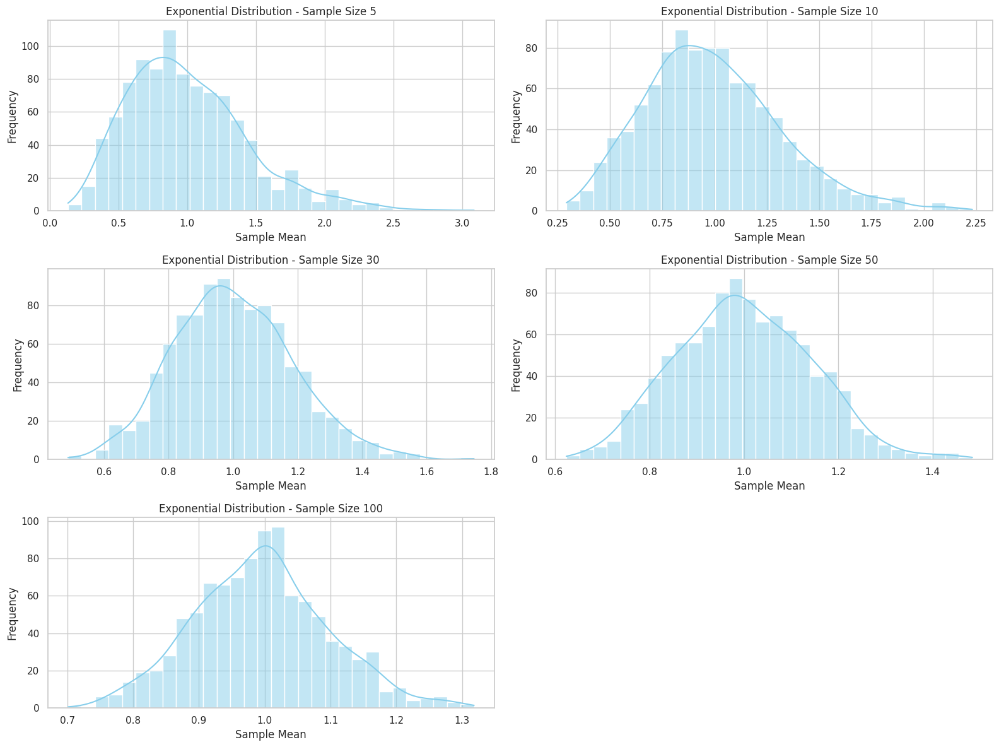
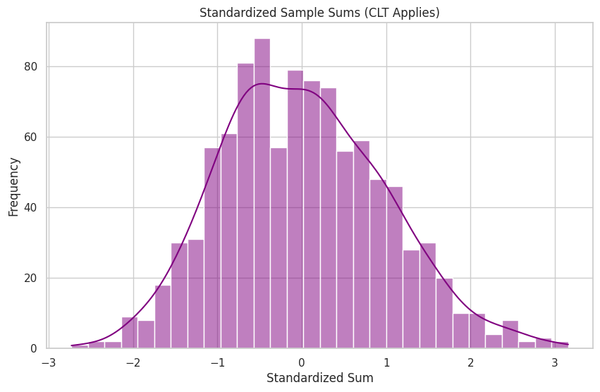

# Problem 1
# Central Limit Theorem (CLT) Exploration through Simulation

##  Motivation

The Central Limit Theorem (CLT) is a cornerstone of probability theory and inferential statistics. It explains why the normal distribution appears so frequently in the natural and social sciences. The theorem provides a powerful justification for using normal models in hypothesis testing, confidence intervals, and quality control—even when the data does not initially appear normal.

In this notebook, we aim to:

* Explore the CLT by simulating sampling distributions from different population distributions.
* Understand how and why the sample mean becomes approximately normal.
* Investigate the influence of sample size and population variance on the distribution of sample means.

This approach helps bridge theory and practice, illustrating why the CLT is fundamental to real-world data analysis.

---

##  Definitions and Fundamental Concepts
### Population

The full set of items or individuals under study. Denoted by the capital letter \$X\$.

###  Sample

A subset of the population selected randomly to make statistical inferences.

###  Random Variable

A variable that represents outcomes of a random phenomenon. It can be discrete or continuous.

### Sample Mean (\$\bar{X}\$)

The average of a sample of \$n\$ observations:

$$
\bar{X} = \frac{1}{n} \sum_{i=1}^{n} X_i
$$

###  Population Mean (\$\mu\$)

The true mean of the population:

$$
\mu = \mathbb{E}[X] = \lim_{n \to \infty} \frac{1}{n} \sum_{i=1}^{n} X_i
$$

###  Variance (\$\sigma^2\$) and Standard Deviation (\$\sigma\$)

Variance is the expected squared deviation from the mean:

$$
\sigma^2 = \mathbb{E}[(X - \mu)^2]
$$

Standard deviation is the square root of variance.

###  Standard Error (SE)

The standard deviation of the sample mean:

$$
SE = \frac{\sigma}{\sqrt{n}}
$$

This measures the spread of the sampling distribution of the mean.

---

##  Central Limit Theorem: Formal Statement

Let \$X\_1, X\_2, \dots, X\_n\$ be i.i.d. (independent and identically distributed) random variables with mean \$\mu\$ and variance \$\sigma^2\$. Then, as \$n \to \infty\$:

$$
\frac{\bar{X} - \mu}{\sigma/\sqrt{n}} \xrightarrow{d} \mathcal{N}(0, 1)
$$

In words, the distribution of the sample mean becomes approximately normal as the sample size increases, regardless of the original distribution.

---

## Simulating the CLT with Different Distributions

We consider three population distributions:

### 1. Uniform Distribution \$U(0,1)\$

* Continuous, bounded, symmetric.
* Easy to visualize convergence.

### 2. Exponential Distribution \$\text{Exp}(\lambda=1)\$

* Continuous, right-skewed, unbounded.
* Requires larger sample sizes for normal approximation.

### 3. Binomial Distribution \$\text{Bin}(n=10, p=0.5)\$

* Discrete, symmetric for \$p=0.5\$.
* Demonstrates CLT even in non-continuous distributions.

For each distribution:

* Simulate a large population (e.g., 100,000 values).
* Randomly sample with sizes \$n = 5, 10, 30, 50, 100\$.
* Repeat sampling (e.g., 1,000 times) and compute sample means.
* Visualize distributions of sample means with histograms.

---

##  Visualization and Intuition

We expect the following patterns:

* Small \$n\$: Histograms resemble the original distribution.
* Medium \$n\$ (30+): The shape of the histogram smooths out.
* Large \$n\$ (50+): The histogram becomes bell-shaped.

### Table: Convergence Behavior

| Distribution      | Shape     | CLT Speed | Notes                      |
| ----------------- | --------- | --------- | -------------------------- |
| Uniform(0,1)      | Symmetric | Fast      | Smooth and bounded         |
| Exponential(1)    | Skewed    | Slow      | Requires larger \$n\$      |
| Binomial(10, 0.5) | Discrete  | Moderate  | Symmetry helps convergence |

---

##  Key Properties of Sampling Distributions

* **Mean of the sample means** equals the population mean (\$\mu\$).
* **Standard deviation of the sample means** equals \$\sigma / \sqrt{n}\$.
* Shape approaches normality as \$n\$ increases.

This explains why sampling distributions of statistics like \$\bar{X}\$ can be approximated with normal models—even if the underlying data is non-normal.

---

## Applications of the Central Limit Theorem

###  Confidence Intervals

The CLT enables construction of confidence intervals:

$$
\bar{X} \pm z_{\alpha/2} \cdot \frac{\sigma}{\sqrt{n}}
$$

Where \$z\_{\alpha/2}\$ is the standard normal quantile (e.g., 1.96 for 95% CI).

### Hypothesis Testing

CLT validates the use of \$z\$- and \$t\$-tests by approximating the distribution of the test statistic.

### Quality Control

Control charts track sample means. CLT ensures the chart limits are based on the normal distribution.

###  Financial Modeling

Sum of returns over time behaves normally, helping model portfolio risk and forecast future prices.---

## Further Exploration

* Test the CLT with other distributions: Poisson, Beta, Log-normal.
* Try non-i.i.d. data and see how convergence fails.
* Compare sample means to medians or variances.
* Explore CLT in the context of bootstrap resampling.

---

##  Summary and Key Takeaways

* The CLT shows that sample means become normally distributed as sample size increases.
* The sampling distribution’s spread decreases as \$n\$ increases.
* Even skewed or discrete data produces normal-looking sample means at large \$n\$.
* The CLT underlies confidence intervals, hypothesis tests, and many practical tools in statistics.

Understanding the Central Limit Theorem not only provides theoretical insight—it’s essential for applying statistics in the real world.

