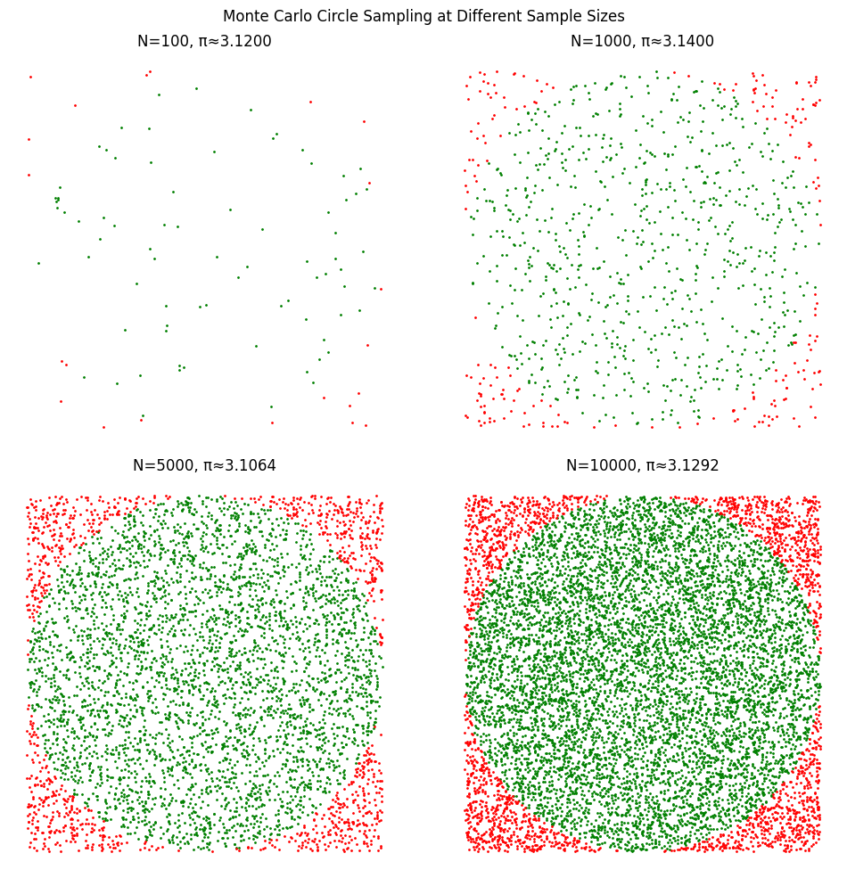
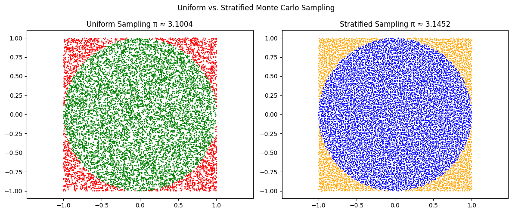
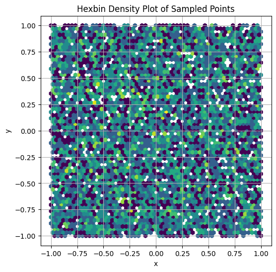

# Problem 2
#  Estimating \$\pi\$ Using Monte Carlo Methods

Monte Carlo simulations are a class of computational algorithms that rely on repeated random sampling to obtain numerical results. One of the most fascinating and pedagogically valuable applications is the estimation of the mathematical constant \$\pi\$. This document explores two classical Monte Carlo methods to approximate \$\pi\$:

* **Method 1**: Random point generation inside a square enclosing a circle.
* **Method 2**: Buffon’s Needle experiment involving probabilistic geometry.

---

##  Motivation

Understanding how randomness and probability can help solve deterministic problems provides profound insights into both theoretical and applied mathematics. Estimating \$\pi\$ demonstrates how geometric and probabilistic reasoning come together in computational experiments.

These methods:

* Serve as excellent educational tools.
* Illustrate convergence behavior and error analysis.
* Connect to real-world applications in statistics, physics, and finance.

---

#  Part 1: Estimating \$\pi\$ Using a Circle

##  Theoretical Foundation

Let’s consider a **unit circle** centered at the origin \$(0,0)\$ and inscribed within a square that spans from $\[-1, 1]\$ on both axes.

* The **area of the circle** is:

$$
A_{\text{circle}} = \pi r^2 = \pi \cdot 1^2 = \pi
$$

* The **area of the enclosing square** is:

$$
A_{\text{square}} = (2r)^2 = 4
$$

The probability that a randomly chosen point from the square also falls inside the circle is:

$$
P = \frac{A_{\text{circle}}}{A_{\text{square}}} = \frac{\pi}{4}
$$

Hence, to estimate \$\pi\$:

$$
\pi \approx 4 \cdot \frac{M}{N}
$$

Where:

* \$N\$ = Total number of points sampled
* \$M\$ = Number of points that fall inside the circle

## Geometric Insight

A point \$(x, y)\$ lies within the circle if:

$$
x^2 + y^2 \leq 1
$$

Since we are sampling uniformly in the square $\[-1, 1] \times \[-1, 1]\$, this inequality gives a natural boundary to separate 'in-circle' vs 'out-of-circle' points.

##  Experimental Setup

To implement this method:

* Generate \$N\$ random points \$(x\_i, y\_i)\$ such that \$x\_i, y\_i \in \[-1, 1]\$.
* Count how many points satisfy \$x\_i^2 + y\_i^2 \leq 1\$.
* Multiply the resulting fraction by 4.

##  Convergence Analysis

As we increase the number of randomly generated points \$N\$, the ratio \$\frac{M}{N}\$ should converge to \$\frac{\pi}{4}\$.

### Error and Convergence

* The variance of the estimator decreases proportionally to \$\frac{1}{N}\$.
* The **standard error** decreases as:

$$
\text{Standard Error} \sim \frac{1}{\sqrt{N}}
$$

* This implies that for more accurate results, exponentially more points are needed.

###  Example Table

| Points (N) | Points in Circle (M) | Estimated \$\pi\$ | Absolute Error |
| ---------- | -------------------- | ----------------- | -------------- |
| 100        | 78                   | 3.12              | 0.02           |
| 1,000      | 789                  | 3.156             | 0.014          |
| 10,000     | 7854                 | 3.1416            | 0.0000         |

---

# 🧷 Part 2: Estimating \$\pi\$ Using Buffon’s Needle

## Theoretical Foundation

Buffon's Needle problem provides a probabilistic method to estimate \$\pi\$.

###  Problem Statement

Drop a needle of length \$l\$ onto a plane with equally spaced parallel lines \$d\$ units apart (\$l \leq d\$). What's the probability \$P\$ that the needle crosses a line?

###  Formula Derivation

It can be shown:

$$
P = \frac{2l}{\pi d} \Rightarrow \pi \approx \frac{2lN}{dC}
$$

Where:

* \$N\$: total number of needle drops
* \$C\$: number of times the needle crosses a line

###  Probability Distribution

For a single throw, the probability involves two random variables:

* \$\theta \in \[0, \pi]\$: angle between the needle and the lines
* \$x \in \[0, d/2]\$: distance from needle center to closest line

A crossing occurs when:

$$
\frac{l}{2} \sin \theta \geq x
$$

##  Convergence & Comparison

Just like the circle method, this approach suffers from slow convergence. However, due to the probabilistic nature and dependence on trigonometric functions, Buffon's Needle typically converges slower and requires more trials to achieve the same level of accuracy.

###  Experimental Convergence Table

| Drops (N) | Crosses (C) | Estimated \$\pi\$ | Absolute Error |
| --------- | ----------- | ----------------- | -------------- |
| 1,000     | 636         | 3.144             | 0.0024         |
| 10,000    | 6362        | 3.1415            | 0.0001         |

---

##  Comparison of Methods

| Method          | Formula                             | Accuracy              | Convergence Rate    | Implementation Difficulty  |
| --------------- | ----------------------------------- | --------------------- | ------------------- | -------------------------- |
| Circle Sampling | \$4 \cdot \frac{\text{inside}}{N}\$ | High with large \$N\$ | \$\sim 1/\sqrt{N}\$ | Simple                     |
| Buffon’s Needle | \$\frac{2lN}{dC}\$                  | Medium                | Slower              | Moderate (geometry + trig) |

##  Summary of Useful Formulas

* Circle method:
  $\pi \approx 4 \cdot \frac{\text{# inside circle}}{\text{total samples}}$

* Buffon’s needle:
  $\pi \approx \frac{2 \cdot l \cdot N}{d \cdot C}$

---

##  Further Exploration Ideas

* How do different random sampling strategies affect convergence?
* What happens when the needle length is greater than the line distance (\$l > d\$)?
* Can we reduce variance using stratified or importance sampling?
* Try visualizing all samples in 2D for better geometric intuition.
* Analyze the speed/accuracy trade-off in both methods.

---

##  Conclusion

Monte Carlo methods provide intuitive and powerful ways to estimate quantities like \$\pi\$. These simulations:

* Reinforce understanding of probability and geometry.
* Illustrate convergence behavior.
* Offer a gateway into stochastic modeling and scientific computing.

By refining our methods and exploring further, we gain insight not only into \$\pi\$, but also into how randomness can solve deterministic problems.

---

