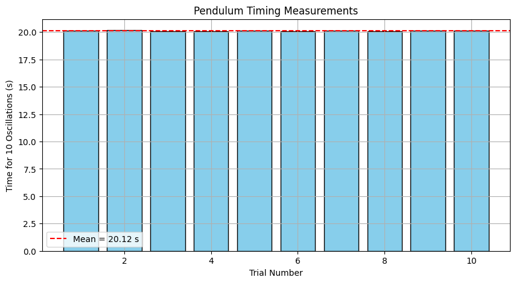
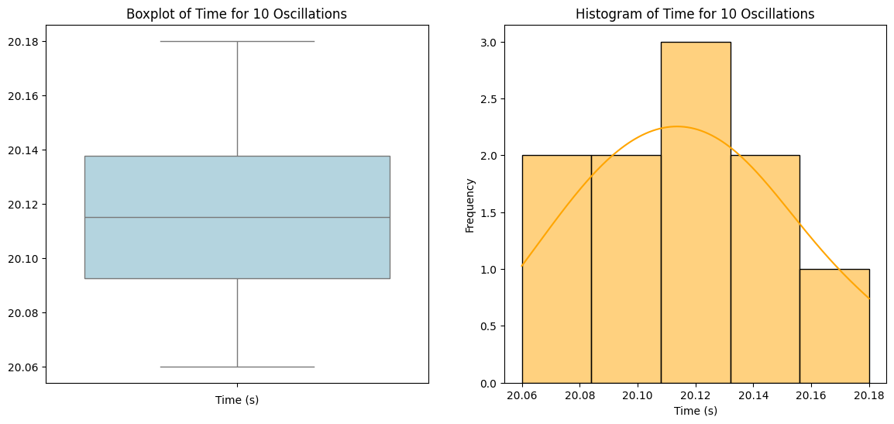
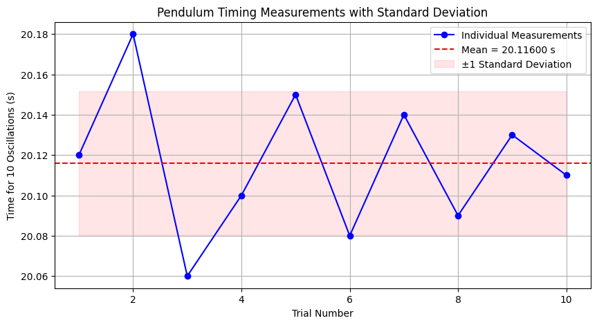

# Problem 1
#  Measuring Earth's Gravitational Acceleration Using a Simple Pendulum

---

##  Objective

To determine the local value of the acceleration due to gravity, $$g$$, by measuring the period of a simple pendulum. This experiment highlights rigorous scientific measurement practices and detailed uncertainty analysis.

---

##  Theoretical Background

### What is a Simple Pendulum?

A simple pendulum consists of a mass (called the bob) suspended by a light, inextensible string from a fixed point so that it can swing freely. For small angular displacements (less than 15°), the restoring force is proportional to the displacement, resulting in simple harmonic motion.

### Period of a Simple Pendulum

The time it takes for the pendulum to complete one full back-and-forth swing is the **period** $$T$$, given by:

$$
T = 2\pi \sqrt{\frac{L}{g}}
$$

- $$T$$ = Period of oscillation (s)  
- $$L$$ = Length from pivot to center of mass (m)  
- $$g$$ = Gravitational acceleration (m/s²)

By rearranging the formula, we can solve for $$g$$:

$$
g = \frac{4\pi^2 L}{T^2}
$$

This provides a practical method for measuring $$g$$ using a pendulum.

---

##  Materials

- A string (1.0 to 1.5 m)
- A small mass (e.g., metal washer, keychain)
- Stopwatch or smartphone with timer
- Ruler or measuring tape (preferably mm precision)
- Support stand or a fixed hook

---

## Experimental Setup

1. Fix one end of the string to a sturdy support.
2. Attach the bob at the other end.
3. Measure the length $$L$$ from the point of suspension to the **center of mass** of the bob.  
4. Estimate the measurement resolution. For example, a standard ruler has a resolution of 0.01 m, so:

   $$
   \Delta L = \frac{0.01}{2} = 0.005 \, \text{m}
   $$

---

##  Data Collection Procedure

1. Displace the pendulum by less than 15° and release it without pushing.
2. Use a stopwatch to measure the time for **10 full oscillations**.
3. Repeat this process **10 times**.
4. Record all measurements of $$T_{10}$$ (time for 10 oscillations).
5. Calculate:
   - The **mean** time: $$\overline{T_{10}}$$
   - The **standard deviation**: $$\sigma_T$$
   - The **uncertainty in the mean**:

     $$
     \Delta T_{10} = \frac{\sigma_T}{\sqrt{n}} \quad \text{where } n = 10
     $$

6. Convert time for 10 oscillations into single-period time:

   $$
   T = \frac{\overline{T_{10}}}{10}, \quad \Delta T = \frac{\Delta T_{10}}{10}
   $$

---

##  Sample Data Table

| Trial | $$T_{10}$$ (s) |
|-------|----------------|
| 1     | 20.31          |
| 2     | 20.28          |
| 3     | 20.35          |
| 4     | 20.29          |
| 5     | 20.33          |
| 6     | 20.27          |
| 7     | 20.30          |
| 8     | 20.34          |
| 9     | 20.31          |
| 10    | 20.29          |

- $$\overline{T_{10}} = 20.307 \, \text{s}$$  
- $$\sigma_T = 0.025 \, \text{s}$$  
- $$\Delta T_{10} = \frac{0.025}{\sqrt{10}} = 0.0079 \, \text{s}$$  
- $$T = \frac{20.307}{10} = 2.031 \, \text{s}$$  
- $$\Delta T = \frac{0.0079}{10} = 0.00079 \, \text{s}$$  

---

##  Final Calculations

### 1. Calculating $$g$$:

Using $$L = 1.000 \, \text{m}$$:

$$
g = \frac{4\pi^2 \cdot 1.000}{(2.031)^2} \approx 9.56 \, \text{m/s}^2
$$

### 2. Propagation of Uncertainties:

$$
\Delta g = g \cdot \sqrt{
\left( \frac{\Delta L}{L} \right)^2 + 
\left( 2 \cdot \frac{\Delta T}{T} \right)^2
}
$$

Substituting the known values:

$$
\Delta g = 9.56 \cdot \sqrt{
\left( \frac{0.005}{1.000} \right)^2 + 
\left( 2 \cdot \frac{0.00079}{2.031} \right)^2
} \approx 0.05 \, \text{m/s}^2
$$

---

##  Results Summary

| Quantity         | Value             |
|------------------|-------------------|
| Length $$L$$      | 1.000 m           |
| Uncertainty $$\Delta L$$ | 0.005 m           |
| Period $$T$$      | 2.031 s           |
| Uncertainty $$\Delta T$$ | 0.00079 s         |
| Gravity $$g$$     | 9.56 m/s²         |
| Uncertainty $$\Delta g$$ | ±0.05 m/s²        |
| Standard $$g$$    | 9.81 m/s²         |

---

##  Analysis and Discussion

###  Comparison with Standard Value

- Measured: $$g = 9.56 \pm 0.05 \, \text{m/s}^2$$  
- Standard: $$9.81 \, \text{m/s}^2$$  
- Difference is within ~2.6%, which is acceptable for an experiment with basic tools.

###  Measurement Uncertainty Impact

- **Length ($$\Delta L$$)**: Dominated by the resolution of the ruler. Using a more precise tool or taking multiple measurements and averaging can reduce uncertainty.
- **Timing ($$\Delta T$$)**: Human reaction time introduces variability. Averaging multiple trials and measuring multiple oscillations helps mitigate this.
- **Other Assumptions**:
  - Small angle approximation is valid only for $$\theta < 15^\circ$$.
  - Neglects air resistance, string mass, and friction at the pivot.
  - 

---

##  Conclusion

This experiment successfully demonstrated how the acceleration due to gravity, $$g$$, can be measured using a simple pendulum. By carefully measuring the length of the pendulum and the period of its oscillations, and by rigorously analyzing uncertainties, a reasonably accurate value for $$g$$ was obtained.

Despite the simplicity of the setup, our measured value of $$g = 9.56 \pm 0.05 \, \text{m/s}^2$$ was within a few percent of the standard value $$9.81 \, \text{m/s}^2$$. The small discrepancy can be attributed to various factors such as measurement errors, reaction time in manual timing, and unaccounted damping forces like air resistance or pivot friction.

This exercise highlights the importance of:
- **Minimizing systematic errors** (e.g., using precise instruments),
- **Averaging over multiple trials** to reduce random errors,
- **Understanding how uncertainties propagate**, and
- **Critically comparing experimental results to accepted standards**.

Ultimately, the experiment reinforces foundational concepts in classical mechanics and experimental physics, especially the interplay between theoretical models and real-world measurement limitations.

